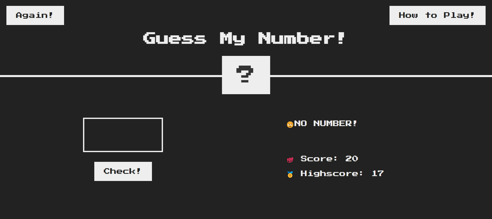
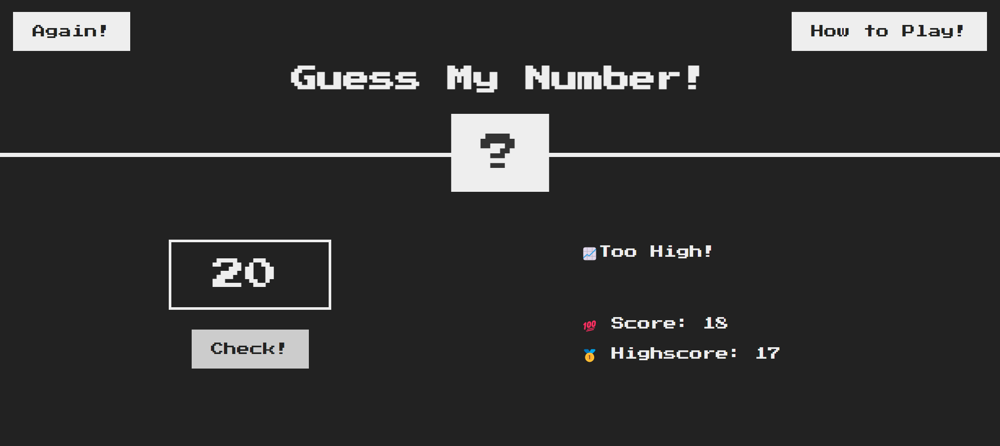
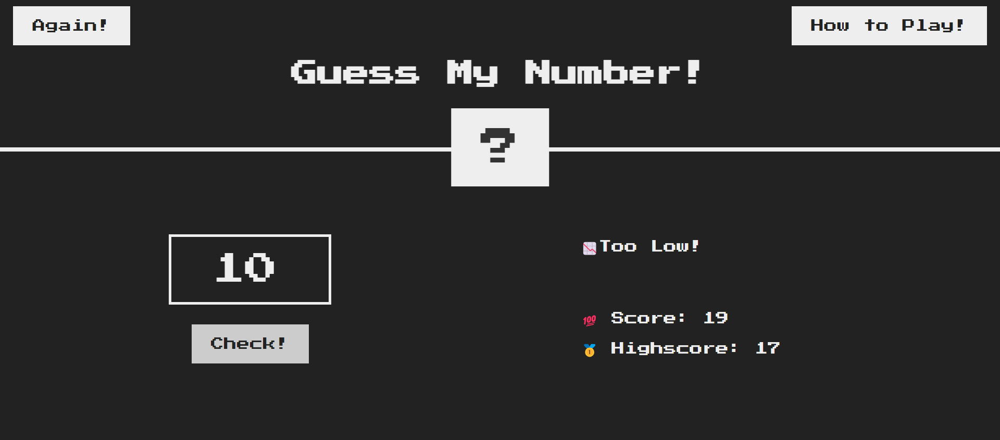
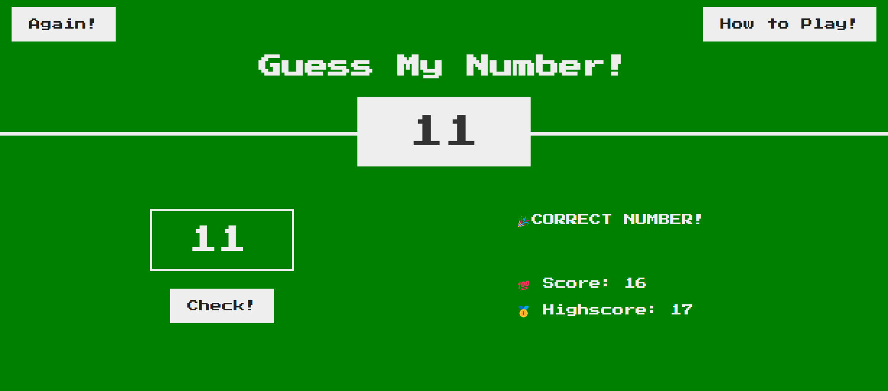

                                                     THE GAME IS ALL ABOUT GUESSING A SECRET NUMBER!
The secret number lies between 1 & 20 , the user has to guess the number based on the information displayed , for example if the message displayed is "📈Too High!"  then try to lower  your number and vice versa 
Try guessing numbers at few attempts , and make a new High score!

Here are some screenshots!

